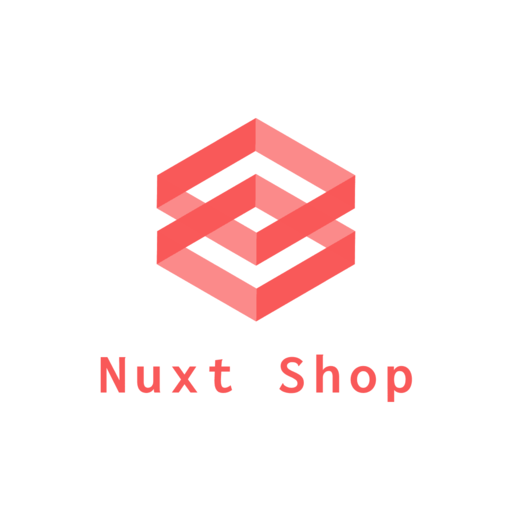

  

<h3 align="center">Nuxt Shop</h3>

---

 An e-commerce project with MACH technology for a Proof of Concept
      

 DEMO: <a href='https://nuxt-ecommerce-template.netlify.app/'>https://nuxt-ecommerce-template.netlify.app/</a>
      

## 📝 Table of Contents

- [About](#about)
- [Getting Started](#getting_started)
- [Deployment](#deployment)
- [Built Using](#built_using)
- [Contributing](#contributing)

## 🧐 About 

Nuxt Shop uses MACH technology together with a JAMstack to provide a Proof of Concept (POC) of an e-commerce. This project is also a PWA, which means that you can install it easily on a smartphone or on a PC as an application.

## 🏁 Getting Started 

These instructions will get you a copy of the project up and running on your local machine for development purposes. See [deployment](#deployment) for notes on how to deploy the project on a live system.

### Prerequisites

What things you need to install the software.

- Node Installed.
- NPM and Netlify CLI packages installed as global dependencies.
- An Amplience account with some blog posts.
- A Commercetools account with some products.

### Installing

Clone this repo to your machine, `cd` into the project directory and do the following:

1. Install dependencies running `npm install` on the command prompt.
2. Run `netlify dev` to get both your project and the serverless functions running on your local environment. (For this step, you need to have the `netlify-cli` npm package installed globally).

You should see now the bare bone of the project in perfect conditions, but with no "life" yet, since you need to set up the serverless functions in order to get the content for the e-commerce.

### Configure Serverless Functions

Inside the `/functions`folder at the project root directory, there are six functions configured already to run on Netlify (you can also check the `netlify.toml` file to check its setup).

All functions receive API keys either from Commercetools or from Amplience. In order to get them, you need to sign up to these platforms and create your own content inside of them.

NOTE: the Front End of the application certainly will need some changes in order to consume the data from the platforms. Attention particularly to any data that goes through Apollo, both in the functions and inside the `/pages` folder.

## 🚀 Deployment 

In order to deploy the project, Netlify is a good option, since it is already configured to use Netlify Functions. To do so, follow the instructions in the [Nuxt documentation](https://nuxtjs.org/docs/2.x/deployment/netlify-deployment) for a statically generated site.

## ⛏️ Built Using 

- [Nuxt.js](https://nuxtjs.org/) - Front End Framework
- [Netlify Functions](https://www.netlify.com/products/functions/) - Serverless Functions
- [Apollo](https://www.apollographql.com/) - GraphQL implementation
- [Amplience](https://amplience.com/) - Content Manager CMS
- [Commercetools](https://commercetools.com/) - eCommerce API Solution

## 💪 Contributing 

If you find anything that needs to be improved or solved or have a great idea for the project, feel free to raise an issue. Thank you.
